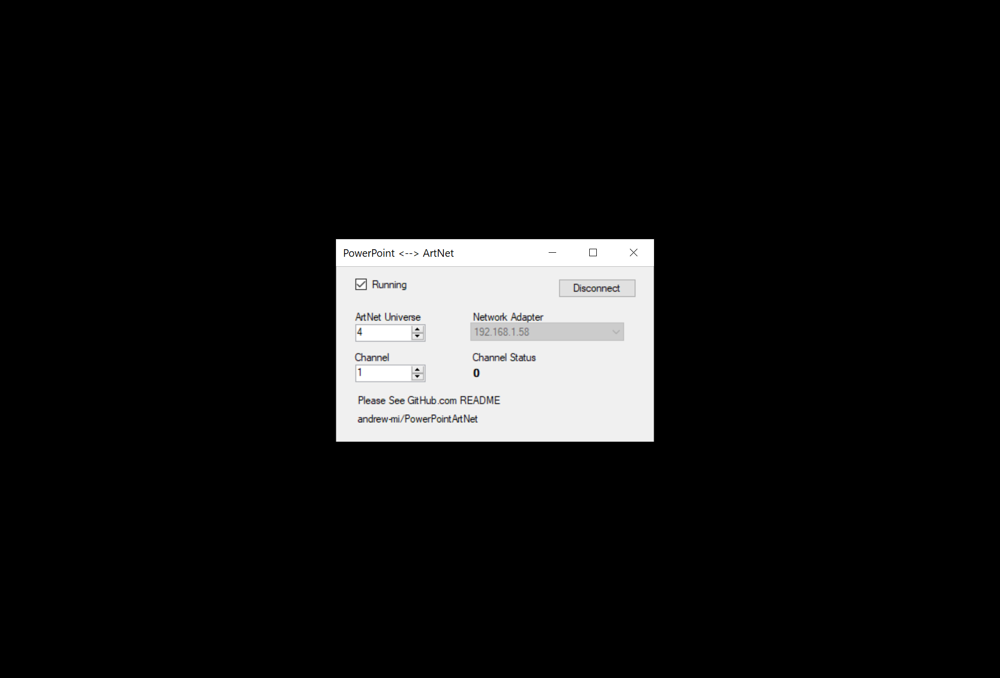

# Control PowerPoint via ArtNet

1. Download from Releases Page
2. Extract then Run (Portable, No Install Required)
3. Start PowerPoint Slideshow
4. Select Network Adapter
5. Choose Universe/Channel
6. Press "Connect"
7. You may have to "disconnect" and "reconnect" if you change between different PowerPoint instances (I haven't been bothered testing-so please report an issue on GitHub)
8. "Flash" 255 on the selected channel to go to the next slide
9. It is trivial add more control over PowerPoint; feel free to create a GitHub issue with requests - this was very much an over-lunch project

Pull Requests Encouraged

### Credits

- ArtNet Library "ArtDotNetLib" from https://github.com/cansik/ArtNet3DotNet
- Costura.Fody from https://github.com/Fody/Costura under MIT License

Code **apart from "ArtDotNetLib"** is available for use under the MIT License described in LICENSE.md